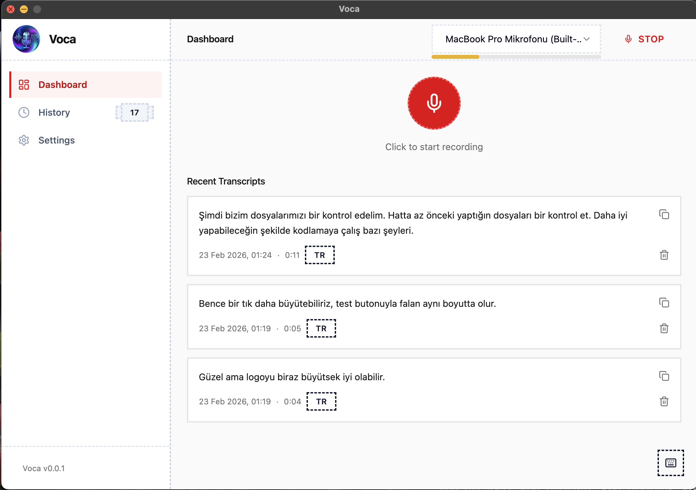

<p align="center">
  
</p>

<h1 align="center">Voca</h1>

<p align="center">
  AI-powered voice-to-text and translation, right where you type.
</p>

<p align="center">
  
  
  
  
  
</p>

---

<p align="center">
  
</p>

---

Press a shortcut, speak, and the transcript is automatically pasted wherever your cursor is. Need it in another language? Voca translates it on the fly with Gemini 2.0 Flash — with a Developer tone that understands your technical jargon.

**Stop paying $8/month for transcription apps.** Deepgram gives every new account **$200 in free credits** — that's essentially a lifetime of personal use. And since Voca is fully open-source, your audio never leaves your machine for any third party. You own your data.

## Why Voca?

- **Free forever (practically)** — $200 free Deepgram credits covers hundreds of hours of transcription. No subscriptions, no hidden fees.
- **Private by design** — 100% open-source. Audio is processed through your own API keys. No data collection, no analytics, no third-party servers storing your recordings.
- **Blazing fast & accurate** — Powered by Deepgram Nova-3, one of the best speech-to-text models available. Supports **35+ languages** with automatic language detection.
- **Instant translation** — Speak in one language, get the translation in another. Powered by Gemini 2.0 Flash with tone-aware prompts (Developer mode keeps your technical terms intact).
- **One-shortcut workflow** — Press a key, speak, done. The transcript (or translation) lands right where your cursor was.
- **macOS & Windows** — Works on both platforms out of the box.

## How It Works

```
Press Right ⌘ (Mac) or Right ⊞ (Win)
        ↓
  Recording overlay appears
  (previous app stays focused)
        ↓
  Press shortcut again to stop
        ↓
  Audio → Deepgram Nova-3 / Groq Whisper
        ↓
  Translation enabled? → Gemini 2.0 Flash
        ↓
  Transcript (or translation) auto-pasted into your app
```

1. **Trigger** — Hit the global shortcut from anywhere. A small floating overlay confirms recording has started.
2. **Speak** — Talk naturally. The overlay shows a live waveform and timer.
3. **Stop** — Press the shortcut again (or click the stop button on the overlay).
4. **Done** — The transcript is copied to your clipboard and automatically pasted into whatever app you were using.

All transcripts are also saved locally in MongoDB so you can search and revisit them later.

## Tech Stack

| Layer | Technology |
|-------|-----------|
| Desktop | Electron 31 + electron-vite |
| Frontend | React 18, Tailwind CSS, Zustand, TanStack Query |
| Backend | Express.js, Mongoose, Multer, express-rate-limit |
| Auth | Google OAuth 2.0, JWT (access + refresh tokens) |
| STT | Deepgram Nova-3, Groq Whisper Large v3 Turbo |
| Translation | Google Gemini 2.0 Flash (via Vercel AI SDK) |
| Database | MongoDB |
| Language | TypeScript (monorepo with pnpm) |

## Project Structure

```
voca/
├── packages/
│   ├── shared/          # TypeScript types, Zod schemas & language constants
│   ├── backend/         # Express API server (port 3100)
│   │   ├── controllers/ # Request handling & response mapping
│   │   ├── services/    # Deepgram, Groq, Gemini, auth & billing services
│   │   ├── middleware/  # Auth, billing, rate limiting, multer, error handling
│   │   ├── models/      # Mongoose schemas (Transcript, User)
│   │   └── uploads/     # Temporary audio storage
│   └── app/             # Electron + React application
│       ├── electron/
│       │   ├── main/    # App lifecycle, shortcuts, overlay, voca:// protocol
│       │   └── preload/ # Secure IPC bridge
│       └── src/
│           ├── pages/   # Dashboard, History, Settings, Billing & Welcome views
│           ├── components/
│           ├── hooks/   # useRecorder, useGlobalShortcut, useRecordingOverlay
│           ├── stores/  # Zustand stores (auth, navigation, recording state)
│           └── services/# API calls via Axios
├── assets/              # Logo and static assets
├── .env.example
├── pnpm-workspace.yaml
└── tsconfig.base.json
```

## Getting Started

### Prerequisites

- **Node.js** 18+
- **pnpm** 8+
- **MongoDB** running locally (or a remote URI)
- **API Key** — at least one of:
  - [Deepgram](https://deepgram.com) — **$200 free credit** on signup (recommended)
  - [Groq](https://console.groq.com) — free tier available
- **Google OAuth** — [Google Cloud Console](https://console.cloud.google.com) — create OAuth 2.0 credentials for authentication
- **Translation (optional)** — [Google AI Studio](https://aistudio.google.com) — free Gemini API key for translation

### Installation

```bash
# Clone the repository
git clone https://github.com/emircansahin/voca.git
cd voca

# Install dependencies
pnpm install

# Configure environment
cp .env.example packages/backend/.env
```

Edit `packages/backend/.env` with your keys:

```env
PORT=3100
MONGODB_URI=mongodb://localhost:27017/voca
GROQ_API_KEY=your_groq_api_key_here
DEEPGRAM_API_KEY=your_deepgram_api_key_here
GEMINI_API_KEY=your_gemini_api_key_here          # optional, for translation
JWT_SECRET=your_jwt_secret_min_32_chars_here
GOOGLE_CLIENT_ID=your_google_client_id_here
GOOGLE_CLIENT_SECRET=your_google_client_secret_here
CORS_ORIGIN=http://localhost:5173                # comma-separated origins
```

### macOS — Grant Permissions First

Before launching the app on macOS, you need to grant **Accessibility** permission so the app can register global shortcuts and simulate paste. Run:

```bash
# This opens System Settings → Privacy & Security → Accessibility
open "x-apple.systempreferences:com.apple.preference.security?Privacy_Accessibility"
```

Add your terminal (or the Electron app) to the allowed list. The app also has a built-in Setup screen that guides you through Microphone and Accessibility permissions on first launch.

### Run

```bash
# Start both backend & app
pnpm dev

# Or start individually
pnpm dev:backend   # Express API on port 3100
pnpm dev:app       # Electron app
```

### Build

```bash
pnpm build
```

## Supported Languages

Voca supports **35+ languages** with automatic detection. Some highlights:

English, Turkish, German, French, Spanish, Portuguese, Japanese, Korean, Chinese, Arabic, Russian, Italian, Dutch, Polish, Hindi, Swedish, Norwegian, Danish, Finnish, Czech, Thai, Vietnamese, and more.

Deepgram's Nova-3 model excels at multilingual detection — it can identify and transcribe the language automatically without any manual selection.

## Transcription Providers

| Provider | Model | Speed | Cost | Best For |
|----------|-------|-------|------|----------|
| **Deepgram** | Nova-3 | Very Fast | $0.0077/min | Accuracy, multilingual, smart formatting |
| **Groq** | Whisper Large v3 Turbo | Fast | $0.111/hr | Budget-friendly alternative |

You can switch between providers in the app at any time.

## Translation

Voca can automatically translate your transcriptions using **Gemini 2.0 Flash**. Enable it in Settings, pick a target language, and choose a tone:

| Tone | What it does |
|------|-------------|
| **Developer** (default) | Keeps technical terms in English (component, API, deploy, middleware). Fixes misheard jargon from STT (e.g. "nahbar" → navbar, "reakt" → React). |
| **Personal** | General-purpose translation with natural phrasing. |

Two optional formatting checkboxes are available when translation is enabled:

| Option | What it does |
|--------|-------------|
| **Numeric** | Converts spoken numbers to digits ("two point five" → 2.5, "one hundred fifty" → 150). |
| **Planning** | Formats numbered lists with line breaks (dictate "first … second …" and get a clean 1. 2. 3. list). |

These options work even when the source and target language are the same — useful for reformatting speech without translating.

When translation is active, the shortcut-paste workflow sends the translated text directly. In History, you can toggle between original and translated text on each card. Token usage (input/output/cached) is displayed per transcript.

Translation is fully optional — it requires a free [Google AI Studio](https://aistudio.google.com) API key and can be toggled on/off at any time.

## Security

- **Authentication** — Google OAuth 2.0 with JWT access tokens (15min) and refresh tokens (7 days)
- **Rate Limiting** — IP-based limits: 60 req/min global, 10 req/min for auth and transcription endpoints
- **Input Validation** — Zod schemas for all inputs, `LANGUAGE_CODES` enum for language fields, magic bytes verification for audio uploads
- **CORS** — Configurable via `CORS_ORIGIN` env var, not hardcoded
- **Billing Protection** — Credit deduction before transcript creation, atomic MongoDB operations

## Roadmap

- [x] AI-powered translation with tone support (Developer / Personal)
- [x] Click-to-copy on transcript cards
- [x] Relative timestamps ("20 minutes ago" instead of "22 Feb ...")
- [x] Cancel button on recording overlay (discard and re-record)
- [x] Rewrite recording overlay with React
- [x] Numeric & Planning formatting options for translation
- [x] Google OAuth authentication with deep link callback
- [x] Credit-based billing system (Pro / Max plans)
- [x] Rate limiting and CORS hardening
- [ ] Verify Windows build and end-to-end functionality
- [ ] Multi-language UI with localized content
- [ ] Audio-reactive waveform visualization (bars respond to microphone input levels)

## Contributing

Contributions are welcome! Here's how to get started:

1. **Fork** the repository
2. **Clone** your fork
   ```bash
   git clone https://github.com/<your-username>/voca.git
   cd voca
   ```
3. **Install** dependencies
   ```bash
   pnpm install
   cp .env.example packages/backend/.env  # add your API keys
   ```
4. **Create a branch** for your change
   ```bash
   git checkout -b feat/my-feature
   ```
5. **Run** the app in dev mode
   ```bash
   pnpm dev
   ```
6. **Commit** your changes, then **push** and open a **Pull Request**

A few things to keep in mind:

- Check the [Roadmap](#roadmap) for ideas on what to work on
- Open an issue first if you're planning a large change
- Keep PRs focused — one feature or fix per PR

## License

MIT
